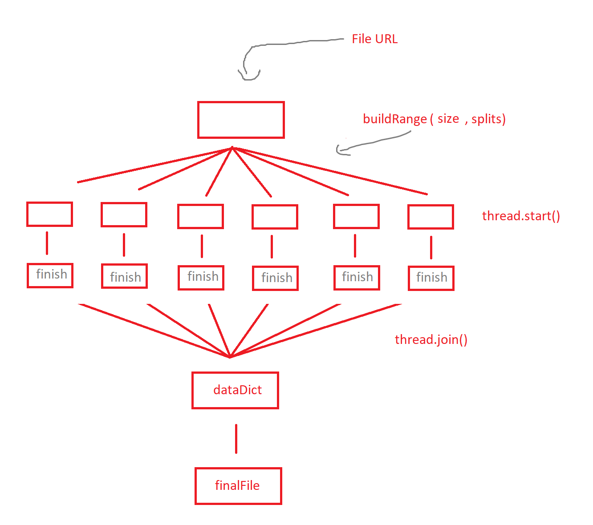

# Download Manager Boy

This project is a simple download manager which implements multi-threading using Python 3 and PyQt5 GUI.

## Getting Started

These instructions will get you a copy of the project up and running on your local machine for development and testing purposes.

### The Idea



### Prerequisites

These are the things you need to install the program and how to install them

```
Python 3
PyQt5
PyQt5-tools
```

### Installing

A step by step series of examples that tell you how to get a development env running

```
pip install PyQt5
pip install PyQt5-tools
```

And make sure the dependencies are installed before, you will find it error if below libraries were not installed

```
import threading
import requests
import urllib
```

## Running the program

To run the program, we just need to start debugging on any IDE preferred that supports Python.

First the program will load the `downloadmanager.ui` and asks inputs for the download file URL, filename and splits(breaking file into how many threads).

Later the file will be downloading and when finished, we should see dialog in the debug console. The downloaded file can be found on the same folder of the `main.py` file.

Note that `downloadmanager.ui` is the file that allows us to do some development on the GUI and this file opens on PyQt5 `designer.exe` for **windows OS** machine.
It is located on `yourPythonFolder/Lib/site-packages/pyqt5_tools/Qt/bin`. It may be a little different on other OS.

## Demo

[Download Manager Boy](https://youtu.be/hRUw0N4X6GQ) - Youtube

## Built With

* [Python 3](https://www.python.org/downloads/) - General-purpose programming language.
* [PyQt5](https://pypi.org/project/PyQt5/) - Cross-platform GUI toolkit

## Contributing

Pull requests are welcome. For major changes, please open an issue first to discuss what you would like to change and submitting pull requests to us.

## License

[MIT](https://choosealicense.com/licenses/mit/)

## Acknowledgments

* Hat tip to anyone whose code was used.
* All Thanks to our lecturer Mr. [Noprianto](https://nopri.github.io/) for his encouraging ideas that triggered us to develop one, this project.
